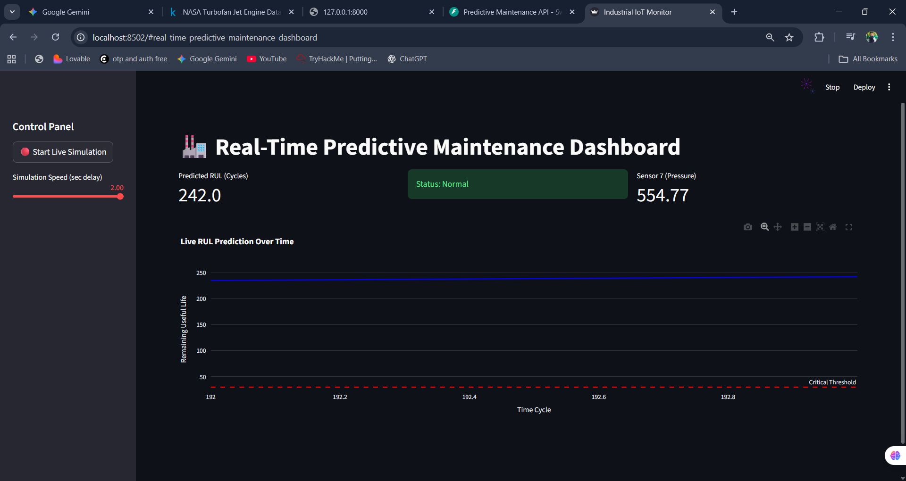

# 🏭 Real-Time Predictive Maintenance System (IIoT)


> **An End-to-End Industrial IoT solution that predicts equipment failure before it happens.**

---

## 📖 Project Overview
In industrial manufacturing, unexpected equipment failure costs millions in downtime. This project simulates a **Smart Factory** environment where sensor data is analyzed in real-time to predict the **Remaining Useful Life (RUL)** of jet engines.

Using the **NASA CMAPSS Turbofan Dataset**, I built a full-stack AI application that:
1.  **Streams** live sensor data (Temperature, Pressure, Vibration).
2.  **Processes** it using an **XGBoost** regression model.
3.  **Serves** predictions via a **FastAPI** microservice.
4.  **Visualizes** asset health on a live **Streamlit Dashboard**.

### 🎯 Key Features
* **Predictive Analytics:** Accurately forecasts engine failure (RUL) using historical sensor patterns.
* **Real-Time Simulation:** Mimics live IoT data streaming row-by-row.
* **Microservice Architecture:** Decoupled Model API (FastAPI) from the User Interface (Streamlit).
* **Condition Monitoring:** Visual alerts when assets cross critical safety thresholds (RUL < 30 cycles).

---

## 📸 Dashboard Preview
*(Add a screenshot of your dashboard here. E.g., dashboard_screenshot.png)*


---

## 🛠️ Tech Stack
* **Language:** Python
* **Machine Learning:** XGBoost, Scikit-Learn, Pandas, NumPy
* **Backend API:** FastAPI, Uvicorn, Pydantic
* **Frontend Dashboard:** Streamlit, Plotly (Interactive Charts)
* **Data Source:** NASA CMAPSS Jet Engine Data Set

---

## 📂 Project Structure
```bash
├── 1_data_prep.py          # Cleans raw NASA data & calculates RUL targets
├── 2_train_model.py        # Trains XGBoost model & handles Feature Engineering
├── 3_api.py                # FastAPI backend (The "Brain")
├── 4_dashboard.py          # Streamlit frontend (The "Control Center")
├── rul_model.pkl           # Saved AI Model (Artifact)
├── processed_train_data.csv # Cleaned dataset used for simulation
├── train_FD001.txt         # Raw NASA dataset
└── requirements.txt        # Dependencies

```

---

## 🚀 How to Run Locally

### 1. Clone the Repository

```bash
git clone https://github.com/your-username/predictive-maintenance.git
cd predictive-maintenance

```

### 2. Install Dependencies

```bash
pip install pandas numpy scikit-learn xgboost fastapi uvicorn streamlit plotly requests

```

### 3. Data Preparation & Training

First, process the raw data and train the AI model:

```bash
python 1_data_prep.py
python 2_train_model.py

```

*(This generates `rul_model.pkl` and `processed_train_data.csv`)*

### 4. Start the API Server

Open a terminal and run the backend:

```bash
uvicorn 3_api:app --reload

```

*Server will start at: `http://127.0.0.1:8000`*

### 5. Launch the Dashboard

Open a **second** terminal and run the frontend:

```bash
streamlit run 4_dashboard.py

```

---

## 🧠 Model Performance

* **Algorithm:** XGBoost Regressor
* **Feature Engineering:** Rolling Means (Window=5), Standard Deviation smoothing.
* **Evaluation Metric:** RMSE (Root Mean Squared Error).
* **Result:** The model successfully identifies degradation trends ~50 cycles before critical failure.

---

## 👨‍💻 Author

**Abhishek Shelke**

* **Role:** Information Technology Student (Class of 2027)
* **Focus:** AI, Data Science, and IoT Automation
* **LinkedIn:** [Abhishek Shelke](https://linkedin.com/in/abhishek-shelke-7b2830287)
* **Portfolio:** [Abhishek Shelke Portfolio](https://abhishelke1.github.io/Portfolio-BY-Abhishek-Shelke)

---
